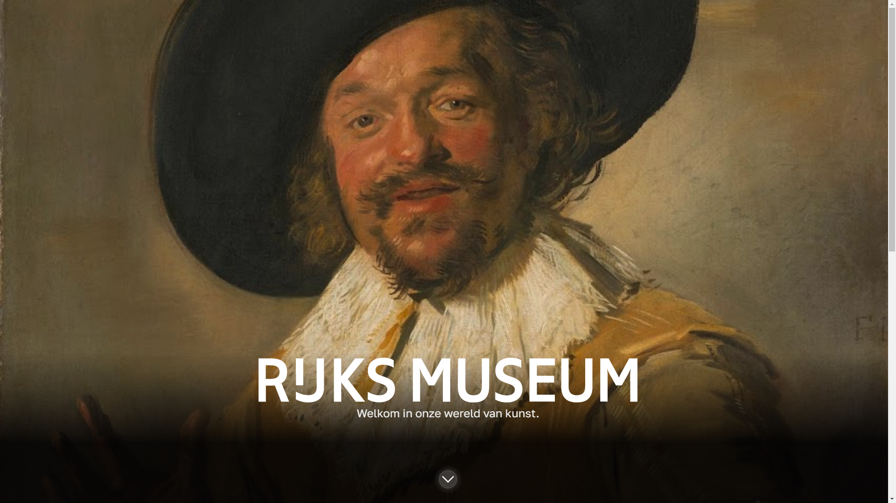

# Progressive Web Apps @cmda-minor-web 2022 - 2023

'Rijksmuseum' is a Single Page Application that let's you explore the Rijksmuseum collection. You can search for artworks, artists and get more information about them.

This specific application is the server-side version of [Rijksmuseum](https://github.com/SundousKanaan/Rijksmuseum)



- [live demo](https://pwa-rijksmuseum-production.up.railway.app/)

## Technologies used
- ejs
- css
- JavaScript
- Node.js
- Express
- Service Worker

- [Rijksmuseum API](https://www.rijksmuseum.nl/nl/onderzoek/onderzoek-doen/data)

## How to install this project? 

1. NPM install

In order to set up the server, you'll require node and express. One way to accomplish this is by utilizing nvm, a package installer that enables you to install various packages. The following code can be used to install the most recent versions of npm and node:

```
nvm install 19.8.1
```

2. Clone repo

To obtain a copy of this repository, execute the following command:

```
https://github.com/SundousKanaan/PWA-Rijksmuseum.git
```

3. NPM install

Install the dependencies by running

```
npm install 
```

4. Start server

```
npm start
```

## Making server

### Install Express

To create a server for my application, I utilized the express library which was installed via npm.

```
npm install express
```

then i have created a `server.js` file in which I will construct my server.

### Express Import

I imported express using the require() method as the first step.

```
    // server.js
const express = require('express');
const app = express();
const port = 5000;
```

I have implemented routing for all the pages of the application, meaning that a page will be rendered if the URL matches. This involves sending a request to retrieve the URL from the server and rendering the page using a templating engine. Below is the structure of a server-side routing.

```
    // server.js
app.use('/', router);

```

`express.Router()` i used an instance of an Express router, which can be used to define and organize route handlers for a specific endpoint. 

To implement server-side routing in Express, we use the `app.method(path, handler)`

```
    // router.js
const router = express.Router();

// home page
router.get('/', async (req, res) => {
  try {
    const data = await fetch.fetchData(API_URL, API_KEY);
    res.render('index', { data: data, object: "/object/", dataDetail: undefined });
    console.log("fetch")

  } catch (error) {
    res.status(500).send(error.message);
  }
})

// offline page
router.get('/offline', async (req, res) => {
  try {
    res.render('offline');
  } catch (error) {
    res.status(500).send(error.message);
  }
})

// zoeken page
router.get('/zoekResultaten', async (req, res) => {
  res.render('zoeken');
})

router.post('/zoekResultaten', async (req, res) => {
  console.log("Start the search fetch");
  const data = await fetch.fetchData(API_URL, API_KEY);
  const AllMakersArray = data.artObjects.map(artObject => artObject.principalOrFirstMaker);
  const AllTitlesArray = data.artObjects.map(artObject => artObject.title)
  const AllobjectsNummbers = data.artObjects.map(artObject => artObject.objectNumber)
  let Alltypes = [];
  let Allmaterials = [];

  try {
  for (const objectNumber of AllobjectsNummbers) {
    try {
      const objectDetails = await fetch.fetchObjectDetails(objectNumber);
      Alltypes = Alltypes.concat(objectDetails.artObject.objectTypes);
      Allmaterials = Allmaterials.concat(objectDetails.artObject.materials);
    } catch (error) {
      console.error(error);
    }
  }

  const MakersArray = [...new Set(AllMakersArray)];
  const TitlesArray = [...new Set(AllTitlesArray)];
  const typesArray = [...new Set(Alltypes)];
  const materialsArray = [...new Set(Allmaterials)];

  let searchValue = req.body.search;
  let zoeken = '';

  console.log("klaar met fetch 1");
  if (MakersArray.includes(searchValue)) {
    zoeken = 'involvedMaker=' + searchValue;
    let searchData = await fetch.fetchZoekURL(API_URL, zoeken);
    console.log("klaar met fetch 2");
    let cleanData = searchData.artObjects.filter(item => item.webImage !== null)
    console.log(cleanData);
    res.render('zoeken', { data: cleanData, searchValue: searchValue, object: "/object/" });
  } 

  // else if for "TitlesArray" "typesArray" and "materialsArray"

  else {
    searchValue = null;
    res.render('zoeken', { searchValue: searchValue });
  }

  } catch (error) {
    res.status(500).send(error.message);
  }
});

// object details page

router.get('/object/:objectNumber', async (req, res) => {
  console.log('ik kom hier')

  const objectNumber = req.params.objectNumber
  try {
    const dataDetail = await fetch.fetchObjectDetails(objectNumber);
    console.log('eerste test')
    res.render('object', { data: dataDetail, object: "/object/" });
  } catch (error) {
    console.log('tweede test')
    res.status(500).send(error.message);
  }
});
```
### Template engine

A templating engine enables rendering of static pages through server-side JavaScript, allowing for implementation of HTML, CSS, and images via the server. There are various types of template engines available, and I have utilized `ejs` for my implementation.

To use this in the server i need to use `app.set();` 

```
    // server.js
// Use the public file
app.use(express.static('public'))
// where is the files
app.set('views', 'views') 
// files type
app.set('view engine', 'ejs');
```

### my files
- `views` where my `ejs` fils set.
- `routes` where my `js` modules set.
- `public` where my online files like `css, Javascript, images, manifest.json and serviceWorker.js`.
- `node_modules` for the `Node js` data.


## How does one use this project? What are its features?

The app caters to art enthusiasts by providing them with the ability to directly access artworks from the Rijksmeseum museum onto their devices, and obtain various details about the work. Users can search for artworks by artist name, work name, type, and the materials used in the artwork's creation.

They can also read the art works details during the offline mode that they viewed during the online mode.

### Maak de applicatie een Progressive Web App.

I converted my application into a Progressive Web App (PWA). This involved making my app installable through the browser onto my local computer. The benefits of PWA include:

- High speed performance ✅
- Ability to use the app offline ✅
- Option to install the app on the home screen of a phone or desktop on a laptop ✅
- Ability to receive push notifications when something happens in the background of the app. ❌

#### How can I make my app a PWA/installable?

To convert the app into a PWA, the following items are required:

- HTTPS
- Service Worker
- Manifest.json file.

## Service Worker

To turn my prototype into a Progressive Web App, I installed a service worker as the next step.

### What is a service worker?
Service workers act as a proxy server between the web application, browser, and network (when there is a connection). Their tasks include:

- Creating a seamless offline experience. ✅
- Monitoring requests and responses between the server and client. ✅
- Enabling access to push notifications. ❌

#### Staps

1. Creating a service worker file. `serviceWorker.js`
2. Registering a service worker.

in the end of the body (in my work in the `footer.ejs`)
This function sends a message to the console confirming that the service worker is registered. I indicate which file is the service worker.

```
<script>
  // Controleer of de servicewerker wordt ondersteund door de browser
  if ('serviceWorker' in navigator) {
    // Wacht tot het venster volledig is geladen voordat u de servicewerker registreert
    window.addEventListener('load', () => {
      // Registreer de servicewerker door de URL naar het servicewerker-bestand te specificeren
      navigator.serviceWorker.register('/serviceWorker.js')
        .then((registration) => {
          // Als de registratie succesvol is, log dan het bereik van de servicewerker in de console
          console.log('ServiceWorker registration successful with scope: ', registration);
          // Forceer een update van de servicewerker
          return registration.update();
        })
        .catch((err) => console.log('ServiceWorker not registration', err));
    });
  }
</script>
```

3. The service worker components

- `cache name variabele` The cache name and vertion in the `Cache Storage`
- `static files array` Files Array that should automatically work offline
-  `install event` To push files into the cache
- `activate event` To clean the previous versions that are in the cache
- `fetch event` Retrieve data from cache (in the offline)

## Critical rendering path

## Activity diagram

## Enhancements

## Checklist
- one ✅
- two ❌
-
-
-

## Sources
[How HTTP POST request work in Node.js?](https://www.geeksforgeeks.org/how-http-post-request-work-in-node-js/)
[node-fetch](https://www.npmjs.com/package/node-fetch)
[ejs](https://ejs.co/)
[Service Worker](https://googlechrome.github.io/samples/service-worker/basic/)
[Lazy loading](https://developer.mozilla.org/en-US/docs/Web/Performance/Lazy_loading)


---
### I did this project for my third year school project.


<!-- Here are some hints for your project! -->

<!-- Start out with a title and a description -->

<!-- Add a nice image here at the end of the week, showing off your shiny frontend 📸 -->

<!-- Add a link to your live demo in Github Pages 🌐-->

<!-- replace the code in the /docs folder with your own, so you can showcase your work with GitHub Pages 🌍 -->

<!-- Maybe a table of contents here? 📚 -->

<!-- ☝️ replace this description with a description of your own work -->

<!-- How about a section that describes how to install this project? 🤓 -->

<!-- ...but how does one use this project? What are its features 🤔 -->

<!-- ...you should implement an explanation of client- server rendering choices 🍽 -->

<!-- ...and an activity diagram including the Service Worker 📈 -->

<!-- This would be a good place for a list of enhancements to optimize the critical render path implemented your app  -->

<!-- Maybe a checklist of done stuff and stuff still on your wishlist? ✅ -->

<!-- We all stand on the shoulders of giants, please link all the sources you used in to create this project. -->

<!-- How about a license here? When in doubt use GNU GPL v3. 📜  -->
